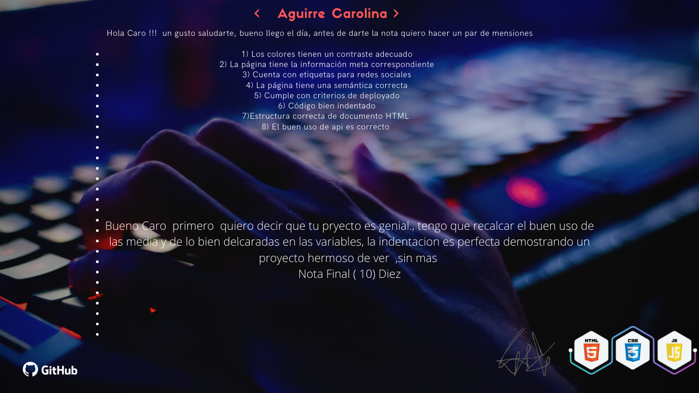

# pag-rickyandmorty
# WorkerTech Frontend Ada 2 [Mayo 2023]
*Profesor: Nahuel Vazquez*
## Estado: Finalizado

*Consigna* 

Para el proyecto final vas a realizar una página web. Este deberá mostrar un listado de personajes de la serie Rick and Morty. Para esto utilizarás una API REST con datos reales, realizarás consultas a la misma pasándole distintos parámetros que permitan paginar la búsqueda y mostrarás los datos obtenidos como respuesta.

*Criterios de aceptación* 

Los requisitos mínimos para que el proyecto sea considerado para la entrega son: 

    ● Debe respetar el diseño “general” dado. Pueden modificarse a gusto colores, fondo, fuentes e íconos. 
    
    ● Debe ser responsive. 
    
    ● Debe cumplir con las funcionalidades principales listadas en la sección siguiente.
    

*Funcionalidades principales* 

● Se debe poder realizar mostrar un listado de personajes de la serie 

● Se debe poder ver la siguiente información de cada personaje: 

    ○ Nombre 
    
    ○ Género 
    
    ○ Especies 
    
    ○ Estado 
    
    ○ Origen 
    
    ○ Locación
    
● Se debe poder filtrar por la propiedadgender(female, male, genderless or unknown) 

● Se debe mostrar el total de personajes listados 

● Se debe poder mostrar los resultados en distintas páginas. El endpoint de la API devuelve máximo 20 personajes por pagína: https://rickandmortyapi.com/documentation/#get-all-characters 

    ○ Se debe mostrar 20 resultados por página 
    
    ○ Se debe poder ir a la primera página 
    
    ○ Se debe poder ir a la última página 
    
    ○ Se debe poder ir a la página siguiente 
    
    ○ Se debe poder ir a la página anterior 
    
    ○ Se deben deshabilitar los botones correspondientes cuando no puedan ser utilizados (por ejemplo, si se está en la última página, no se debe poder utilizar el botón de ir a la última página ni el de avanzar página).
    

Criterios de evaluación 

● Aprobado 

    ○ Respeta la consigna 
    
    ○ Respeta el diseño dado 
    
    ○ Respeta el funcionamiento 
    
    ○ Responsive funciona correctamente

¡Hola Caro! Antes de darte la nota quiero hacer un par de menciones:

1-Los colores tienen un contraste adecuado.

2-la página tiene la información correspondiente.

3-Cuenta con etiquetas para redes sociales.

4-La página tiene una semántica correcta.

5-Cumple con criterios de deployado.

6-Código bien indentado.

7-Estructura correcta del documento HTML.

8-El uso de API es correcto.

Bueno Caro primero quiero decir que tu proyecto es genial, tengo que recalcar el buen uso de la media y de lo bien declaradas que están las variables, la indentación es perfecta demostrando un proyecto hermoso de ver, sin más NOTA FINAL (10) Diez.
